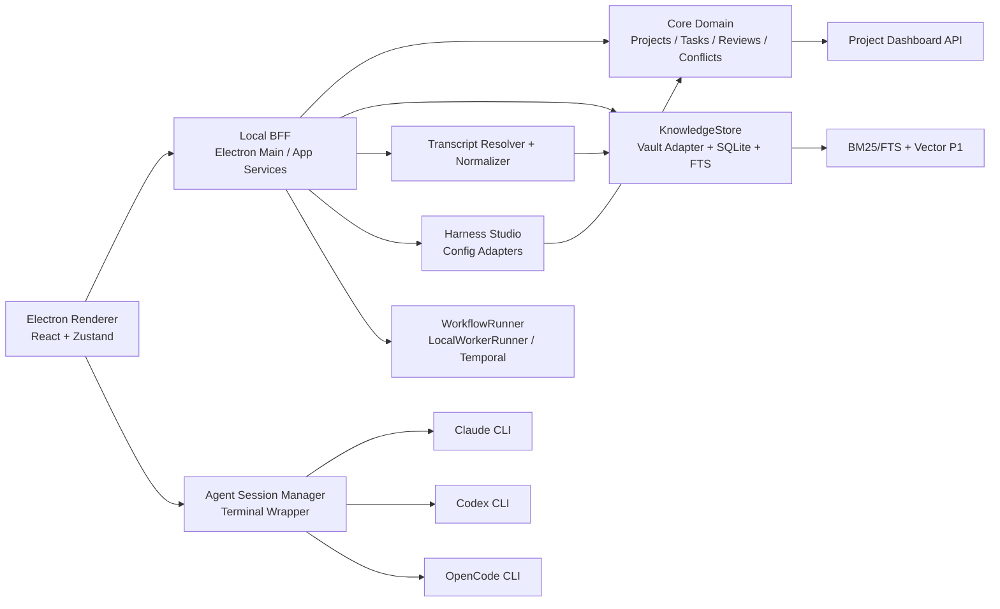
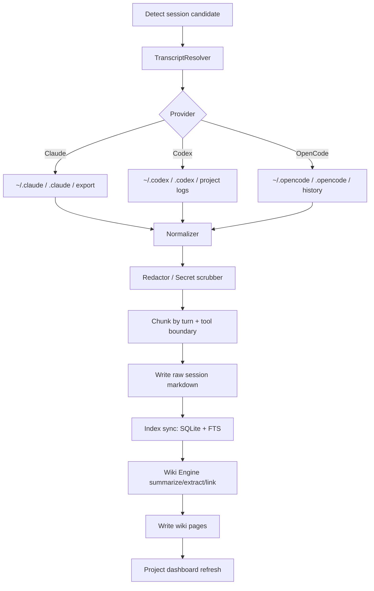

> ## 구현 상태 배너 (2026-06-02, 저장소 ground-truth 대조)
>
> 이 문서는 외부 리서치 기반 **제품 프레이밍 PRD**다. 아키텍처·스택·원칙은 실제 구현과
> 정합하지만, **일부 데이터 모델/기능 세부는 설계 제안(미구현/P1)** 이다. 혼동을 막기 위해
> 빌드된 것과 아직 아닌 것을 아래에 명시한다 (기술 SSOT는 `2026-06-01-agent-project-console-design.md`).
>
> **✅ 구현·테스트 완료 (origin/main):** Electron+React+Node BFF 셸, 12개 패키지
> (shared/core/pm/harness/llm-wiki/search/vault/dashboard-api/app-services/workflow/agents/knowledge),
> terminal-wrapper + transcript resolver(공식 로그 우선, precedence, redaction), conflict 문서,
> SQLite FTS5(BM25) — 세션 인덱스(`@apc/search`) + Markdown 문서 인덱스(`@apc/knowledge`) + context package,
> LocalWorkerRunner, IngestService/RunService/CurrentPromotionService, PM Control Tower(PmHome/ModelPicker/
> ReviewActions/HarnessPanel), Harness Studio **OpenCode read+select**.
>
> **⚠️ 이 PRD가 앞서 있는(미구현/P1) 부분:**
> - `HarnessProfile`(scope user/project/task, instructions/metadata) ≠ 실제 `AgentProfile`
>   (scope global/project/local/managed, mode/permissions/prompt, **read-only**). 이름·필드 상이.
> - `WikiPage` 엔티티(kind/outgoingWikiLinks/tags) **미구현** — 현재는 `WikiGeneration`/`CurrentProposal`
>   + `@apc/knowledge` 문서 모델.
> - 명명 워크플로(`IngestSessionWorkflow` 등) **미구현** — generic `LocalWorkerRunner` + app-services로 대체.
> - Harness **편집/diff/validate/apply**, Codex/Claude config 어댑터 = **P1+ 미구현** (현재 OpenCode read만).
> - `AgentSession.resolverSource/transcriptUri` = 명명 차이(실제 `transcriptPath/terminalCapturePath/kind`).
> - Vault 폴더 `sessions/daily/roadmap/decisions/harness/` 일부 = P1.
>
> **🔧 이 PRD에서 코드로 반영 완료(2026-06-02, commit `278de43`):**
> `Task`에 `parentTaskId / acceptanceCriteria / linkedWikiPages / estimate` 추가
> (서브태스크 계층·인수 기준·task↔wiki 링크). 본문 §Architecture의 `Task` 인터페이스 중
> `assigneeAgent`만 미반영(실제 `assignee`/`assigneeType`로 충분).

---

# PM 중심 AI Agent Workbench PRD v0.2

## Executive summary

이 제품의 목표는 **PM이 여러 AI agent와 함께 프로젝트를 운영하는 "개인 작업대"**를 만드는 것이다. 핵심은 네 가지를 하나의 로컬 워크벤치로 묶는 것이다. 첫째, **NexusCode 스타일의 멀티 프로젝트 대시보드**로 여러 프로젝트의 현재 상태를 한 화면에서 본다. 둘째, **seCall 스타일의 LLM Wiki 메모리**로 이전 대화와 작업 결과를 Markdown·YAML frontmatter·`[[wiki-link]]` 중심의 Obsidian 호환 vault에 저장한다. 셋째, **qmd 스타일의 로컬 검색**(Markdown vault + SQLite FTS(BM25) + 선택적 vector)을 기본 검색 엔진으로 삼는다. 넷째, **terminal-wrapper Agent Session Manager**를 중심으로 Claude, Codex, OpenCode를 통합한다.

결론: **런타임은 Electron + React + TypeScript + Node BFF**, 개발은 **공통 모듈(Agent adapters / Vault / Search / WorkflowRunner / BFF contract) 선행 → Dashboard 팀과 LLM Wiki 팀 병렬**. Temporal은 P0 필수가 아니며, long-running ingest / wiki refresh / approval / retry / cancel / audit trail이 중요해지는 시점부터 도입 가치가 있다. P0~P1은 LocalWorkerRunner로 시작하고 P1.5~P2에서 Temporal로 승격한다.

## Product framing and design principles

이 제품은 "코드를 직접 많이 치는 개발자 도구"보다 **PM이 작업을 분해하고, agent에게 할당하고, 결과를 리뷰하고, 다음 task를 생성하는 운영 툴**이다. 성공 지표는 IDE 기능 깊이가 아니라 **프로젝트 상태 가시성**, **과거 작업 맥락 재사용성**, **agent 실행 통제성**, **산출물 추적 가능성**, **Obsidian 호환성**이다.

핵심 설계 원칙 여섯 가지: **local-first**, **Obsidian-compatible**, **agent-agnostic**(라이브는 terminal wrapper로 통일, ingest는 agent별 resolver로 정규화), **PM-first**(기준 엔티티는 파일이 아니라 프로젝트/태스크/리뷰/결정/위키 문서), **reviewable automation**(설정 적용·wiki 갱신·ingest 증분·profile attach는 diff·validate·apply), **conflict-transparent**(충돌은 숨기지 않고 conflict 문서로 승격).

## Architecture

### High-level architecture



아키텍처는 **UI / BFF / Domain services / Storage / Workflow orchestration**으로 나눈다. 패키지 매핑: `shared`(schema/contract), `core`(DB/registry/conflict/cursor), `pm`(task/review/vault writer), `harness`(config adapter/profile store), `llm-wiki`(agent runner/prompt/wiki engine), `search`(search index), `vault`(vault adapter), `dashboard-api`(project dashboard), `app-services`(ingest/run/current-promotion), `workflow`(local-worker-runner), `agents`(adapters/redact), `knowledge`(markdown 검색/context package).

### TypeScript-like core interfaces

> 주: 아래 `Task`는 PRD 제안형이다. **실제 구현된 `Task`** 는 `id/projectId/title/status/assigneeType/
> assignee/priority/dueDate/estimate/parentTaskId/acceptanceCriteria/linkedWikiPages/contextPackage/reviewStatus`
> 이다(2026-06-02 반영). `HarnessProfile`/`WikiPage`/`AgentSession`은 §배너의 차이를 참고.

```ts
export type AgentKind = "claude" | "codex" | "opencode";
export type ProjectType = "git" | "obsidian" | "hybrid";
export type ProjectStatus = "active" | "maintenance" | "paused" | "archived";
export type TaskStatus = "todo" | "in_progress" | "review" | "done" | "rejected";
export type ReviewStatus = "none" | "pending" | "approved" | "needs_changes" | "rejected";

export interface Project {
  id: string; name: string; status: ProjectStatus;
  goal?: string; currentFocus?: string; startDate?: string; targetDate?: string;
  projectType: ProjectType; repoPaths: string[]; vaultPaths: string[]; sourcePaths: string[];
}

export interface Task {
  id: string; projectId: string; title: string; status: TaskStatus;
  assigneeType: "agent" | "human"; assigneeAgent?: AgentKind;
  dueDate?: string; estimate?: string; parentTaskId?: string;
  acceptanceCriteria?: string[]; linkedWikiPages?: string[];
}

export interface AgentSession {
  id: string; projectId: string; taskId?: string; agent: AgentKind;
  cwd: string; startedAt: string; endedAt?: string; command: string; args: string[];
  resolverSource: "official_log" | "project_log" | "export" | "terminal_capture";
  transcriptUri?: string; status: "running" | "completed" | "failed" | "cancelled";
}

export interface WikiPage {
  id: string; projectId: string; path: string; title: string;
  kind: "task" | "decision" | "entity" | "daily" | "summary" | "playbook" | "conflict";
  sourceSessionIds: string[]; outgoingWikiLinks: string[]; tags: string[]; updatedAt: string;
}

export interface HarnessProfile {
  id: string; provider: AgentKind; name: string;
  scope: "user" | "project" | "task"; sourcePath: string;
  rawFormat: "json" | "jsonc" | "toml" | "yaml" | "md";
  tools?: string[]; model?: string; instructions?: string; metadata?: Record<string, unknown>;
}
```

### Component responsibilities

| 컴포넌트 | 책임 | 비고 |
|---|---|---|
| AgentSessionManager | 각 agent CLI 실행, stdin/stdout/exit 관리, 세션 메타 수집 | live execution은 terminal wrapper 중심 |
| TranscriptResolver | Claude/Codex/OpenCode 로그·export·project history를 찾아 정규화 입력 생성 | terminal output만으로 ingest하지 않음 |
| KnowledgeStore | vault 쓰기, sqlite 메타 저장, search index 유지, conflict 문서 생성 | Obsidian-compatible |
| HarnessStudio | provider 설정 로드/파싱/편집/diff/validate/apply | Codex subagents, OpenCode agents/modes/plugins, Claude settings hook 편집 |
| BFF | renderer와 domain 사이 API boundary, validation, orchestration | Electron main 내부 local BFF |
| WorkflowRunner | ingest / wiki refresh / reindex / conflict repair / long jobs 실행 | P0 LocalWorkerRunner, P1.5 Temporal 후보 |

### Recommended runtime stack

권장 스택은 **Electron + React + TypeScript + Node BFF**. 근거: 현재 저장소가 이미 이 스택; contract가 전부 TypeScript; xterm/PTY·SQLite·파일시스템·local vault·renderer-main bridge가 Electron에서 자연스러움; Obsidian 호환 + 독립 앱 경험; App 골격(사이드바·PM 홈·Harness·터미널)이 이미 존재.

| 옵션 | 장점 | 약점 | 권장도 |
|---|---|---|---|
| FastAPI + React | ingest/파이썬 생태계 강점 | TS contract 이탈, 독립 앱 경험 약함 | 낮음 |
| Electron + React + Node | 현재 설계/저장소 정합성 최고, 데스크톱/PTY/SQLite 우수 | 메모리/패키징 무게 | **최고** |
| Tauri + React | 가벼움, 네이티브 느낌 | Rust 셸 학습, 재사용도 낮음 | 중간 |
| Next.js local fullstack | 풀스택 편의성 | 장시간 local job/PTY/desktop UX 부적합 | 낮음 |

## Data, ingestion, and retrieval

### Vault and storage strategy

저장 포맷은 **Obsidian-compatible Markdown vault**. 권장 구조:

```yaml
vault/
  projects/
    <project-slug>/
      project.md
      roadmap.md
      tasks/        # T-001.md ...
      decisions/    # D-001.md
      sessions/     # S-2026-06-01-claude-001.md
      wiki/         # architecture.md, domain-model.md ...
      daily/        # 2026-06-01.md
      harness/profiles/   # codex-reviewer.toml, opencode-plan.json ...
      conflicts/    # C-2026-06-01-task-T-001.md
```

각 프로젝트는 **Git repo 하나 또는 Obsidian folder 하나를 project unit**으로 본다. Markdown 문서끼리는 `[[wiki-link]]`로 연결하고, frontmatter에 `projectId/taskId/sourceSessionIds/status/updatedAt/agent/tags`를 둔다. SQLite는 작고 빠른 **local metadata / index / cache** 역할(테이블: projects/tasks/reviews/agent_sessions/transcript_chunks/wiki_pages/wiki_links/entities/conflicts/embeddings/search_docs/workflows/workflow_events).

### Ingestion pipeline

LLM Wiki ingest는 **terminal 화면 캡처가 아니라 agent별 transcript/log resolver**를 통한다.



**Resolver precedence:** 1) project-local official logs → 2) user-global official logs → 3) explicit export files → 4) terminal capture fallback → 5) skip + mark unresolved.

**Normalizer outputs:** canonical session header / normalized messages / tool calls·results / task inference hints / file touch list / branch·worktree·cwd / provider metadata / timestamps.

**Fallback rules:** 공식 로그가 있으면 terminal transcript는 보조 증거로만; 일부 turn만 있으면 `partial=true`; 순서 불안정 시 `integrity=degraded`; schema 파싱 실패 시 raw blob 보존 + 재시도 큐; 충돌 시 덮어쓰지 않고 `conflicts/` 문서; 비밀정보는 redaction 후 raw 접근 축소.

### Search and retrieval design

**BM25/FTS = P0, vector = P1, hybrid(RRF) = P1.5.** 검색 단위: document search / session search / context tree search. 응답은 사람용(문서 카드 + 문맥 체인)과 agent용 JSON을 분리한다.

```ts
interface SearchResponse {
  query: string; mode: "keyword" | "vector" | "hybrid";
  hits: Array<{
    kind: "task" | "wiki" | "session" | "decision" | "daily";
    id: string; path: string; title: string; score: number; excerpt: string;
    projectId: string; taskId?: string; sourceSessionIds?: string[]; contextTrail: string[];
  }>;
}
```

### qmd feature mapping to our KnowledgeStore

| qmd/관련 영감 | 우리 제품 설계 매핑 |
|---|---|
| local-first markdown search | vault 문서를 SSOT, SQLite는 index/cache |
| query markdown documents | task/wiki/daily/decision/session 전부 검색 대상 |
| tracker + knowledge base 결합 | PM dashboard와 wiki를 하나의 프로젝트 그래프로 연결 |
| folder-driven organization | `projects/<slug>/{tasks,wiki,daily,conflicts}` |
| fast local retrieval | SQLite FTS(BM25) P0, vector P1 |
| markdown-native authoring | Obsidian에서 열고 편집 |
| saved views/collections | "My Tasks"/"Needs Review"/"Blocked"/"Recent Sessions"/"Rebuild Wiki" |

## UX, dashboard, and harness workflows

### Dashboard wireframe

```text
┌───────────────────────────────────────────────────────────────────────────────┐
│ Top Bar: Project switcher | Ingest | Refresh Wiki | Search | Review Queue   │
├───────────────┬──────────────────────────────────────┬───────────────────────┤
│ Project Pane  │ PM Main                              │ Harness Studio        │
│ - Projects    │ - Goal / Current Focus               │ - Provider selector   │
│ - Status      │ - Timeline / Milestones              │ - Profiles / Teams    │
│ - Active task │ - Task board                         │ - Diff / Validate     │
│ - Last ingest │ - Review queue                       │ - Apply / Rollback    │
│ - Warnings    │ - Recent agent runs                  │ - Source file path    │
├───────────────┴──────────────────────────────────────┴───────────────────────┤
│ Live Agent Session Area: [Claude][Codex][OpenCode] tabs + terminal + attach │
├───────────────────────────────────────────────────────────────────────────────┤
│ Knowledge Drawer: linked wiki pages / decisions / session excerpts           │
└───────────────────────────────────────────────────────────────────────────────┘
```

### Harness Studio

OpenCode/Codex의 명시적 config/profile/subagent 구조를 **시각적 harness engineering UX**로 감싼다.

- **Agent/Team Editor:** provider 선택 → scope(user/project/task) → config source 탐지 → parse + schema validation → form+raw split → diff → validate → apply → snapshot.
- **Diff/Validate/Apply:** current vs proposed diff; schema/path/duplicate/unsupported/provider-warning validate; atomic write + snapshot backup; rollback = previous snapshot restore.
- **Task Profile Attach:** task 선택 → profile 선택 → attach → live session launch 시 profile injection.

### Provider support matrix

| Provider | Live terminal wrapper | Transcript resolver | Harness editor | 비고 |
|---|---|---|---|---|
| Claude | P0 | P0 | P1 제한적 | `~/.claude`/project `.claude`/export 우선. 공식·안정 항목만 UI 편집 |
| Codex | P0 | P0 | P0~P1 | `.codex/config.toml`, profiles, subagents, hooks |
| OpenCode | P0 | P0 | P0~P1 | `.opencode`, custom config dir, AGENTS.md, agents/modes/plugins/providers |

Claude는 보수적으로: 웹 UI 자동화·비공식 조작은 default 금지, "사용자가 직접 실행한 CLI + 사용자가 선택한 로컬 로그/export"만 다룬다.

## Security, policy, and operations

### Claude policy constraints

1. **Claude 연동은 terminal wrapper 우선** — 로컬 `claude` CLI를 PTY로 감싸 stdin/stdout만; web automation·scraping·DOM 조작은 P0 제외.
2. **LLM Wiki ingest는 사용자가 소유/선택한 로컬 transcript·log·export만** 읽는다(라이브 화면 텍스트 아님).
3. **redaction-first** — provider adapter 수준 secret scrubber. P0: API key/token/SSH key/cookie/DSN/email/phone; P1: 사용자 정의 rules.

Claude 계열 통합은 "managed execution / remote persistence를 기본 경로로 삼지 않는다"는 보수적 정책을 따른다.

### Conflict policy

- 기존 문서 자동 overwrite 금지; 충돌 시 `conflicts/` 아래 새 Markdown 생성.
- 문서에 `base/local/incoming/mergeHints/sourceSessionIds/taskId` 포함.
- Dashboard "Resolve conflict" queue 노출; manual resolve 후 원문서 반영; index는 임시로 양쪽 유지.

### Workflow design

P0 WorkflowRunner 작업: `IngestSessionWorkflow`, `RefreshWikiWorkflow`, `ReindexVaultWorkflow`, `ResolveConflictWorkflow`, `AttachHarnessProfileWorkflow`. P0 구현체는 LocalWorkerRunner로 충분. Temporal은 장시간 ingest/refresh, 재시도·cancel, 재시작 resume, human approval, audit trail, multi-project background queue가 필요할 때 **조건부 도입**(P1.5~P2).

## Roadmap, acceptance criteria, risks, and open questions

### Feature scope

| 우선순위 | 기능 |
|---|---|
| P0 | Electron shell, Project dashboard, Claude/Codex/OpenCode terminal wrapper, Project/Task model, Obsidian vault, transcript resolver baseline, BM25/FTS search, ingest-now, conflict 문서, Harness Studio read-only + basic apply |
| P1 | Wiki generation/update, linked decisions/daily/task pages, Harness diff/validate/apply, Codex subagents editor, OpenCode agents/modes editor, review queue, task↔session↔wiki 연결, redaction rules, vector retrieval optional |
| P2 | Temporal orchestration, auto-ingest watches, multi-worktree state board, analytics, agent performance insights, collaboration/export, advanced collections, next-task suggestion |

### Acceptance criteria

1. 한 창에서 여러 프로젝트 전환.  2. 각 프로젝트가 goal/current focus/task board/review queue/recent sessions 표시.  3. Claude/Codex/OpenCode 중 하나로 같은 화면에서 live session 실행.  4. 세션 종료 후 ingest → 원본 session Markdown + wiki page 생성.  5. 생성 문서가 Obsidian에서 손상 없이 열림.  6. P0 검색이 BM25로 task/wiki/session 함께 반환.  7. 충돌 시 덮어쓰지 않고 conflict 문서 생성.  8. Harness Studio가 최소 한 provider config를 parse/diff/validate/apply.  9. task에 harness profile attach.  10. renderer는 preload bridge/BFF로만 main 접근.

### Parallel team plan

- **공통 모듈 팀**: shared schema / BFF / vault / search base / workflow / agent adapters
- **Dashboard 팀**: project/task/review 중심 UI
- **LLM Wiki 팀**: transcript resolver / normalizer / wiki engine / conflict docs
- **Harness 팀**: provider config adapter / diff / validate / apply

### Risk analysis and mitigations

| 리스크 | 완화 |
|---|---|
| Claude 정책 리스크 | CLI wrapper + user-selected local files + no web automation |
| 로그 포맷 변화 | resolver abstraction + raw blob preservation + retry queue |
| Obsidian 호환성 손상 | vault-adapter SSOT + golden tests |
| 검색 품질 부족 | BM25 P0 + context tree + collection filters + vector P1 |
| 설정 편집 파손 | diff/validate/apply + snapshot + rollback |
| Electron 무게 | 패키지 분리, lazy loading, search/vector 옵션화 |
| Temporal 과잉설계 | LocalWorkerRunner 선행, 명확한 조건에서만 도입 |

### Open questions / limitations

- 패키지 내부 상세 구현은 일부 설계안 결합(저장소 ground-truth 대조는 상단 배너 참조).
- Claude "team mode"의 공식 config surface 미확보 → Claude Harness Studio는 P0 제한적 편집, P1 안정 file surface 확장.
- Vector 임베딩 모델/로컬 런타임은 미결 → P0는 BM25/FTS, vector는 P1 선택.

**최종 제품 정의:** "Obsidian 호환 vault를 지식 저장소로 삼고, Claude/Codex/OpenCode를 terminal wrapper와 transcript resolver로 통합하며, PM이 여러 프로젝트의 일정·task·리뷰·agent 실행·LLM Wiki를 한 화면에서 운영하는 Electron 기반 AI Agent Workbench."
